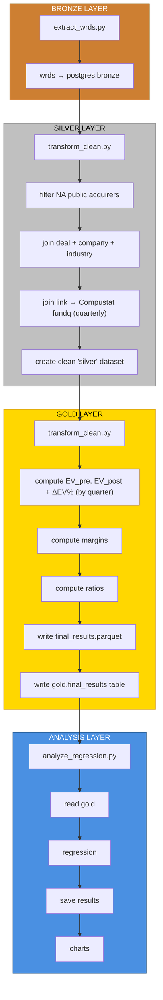

# M&A Value Impact Pipeline (Local Deployment)

## Project Description

This project builds a complete data engineering pipeline that explores how mergers and acquisitions (M&A) affect a company's enterprise value (EV) and profitability. The data comes from WRDS (PitchBook, and Compustat) and moves through a full local data workflow: ingestion, storage, transformation, orchestration, analysis, and testing.

Everything runs locally using **Docker and Apache Airflow**, with data stored in **PostgreSQL** and files organized in Bronze/Silver/Gold layers. This setup demonstrates modular design, reproducibility, and automation through GitHub Actions.

---

## Research Question

When a public company completes an acquisition, does its enterprise value improve from the prior quarter to the following quarter, and how does this vary by deal size, industry, or acquirer characteristics?
---

## Architecture Overview

```
project-root/
├── .devcontainer/              # Configuration for reproducible environment
│   ├── devcontainer.json       # VS Code config
│   ├── docker-compose.yml      # Defines App + Postgres services
│   └── Dockerfile              # Python environment definition
├── dags/                     ← Airflow DAG (extract → transform → analyze)
│   └── ma_pipeline_dag.py
├── src/
│   ├── extract_wrds.py       ← Pulls M&A + Compustat data from WRDS
│   ├── transform_clean.py    ← Cleans and joins deal + financial data
│   ├── analyze_regression.py ← Calculates ΔEV% and runs regression
│   └── utils/                ← Helper functions and schema validation
│       └── db.py               # Database connection helper
├── postgres/
│   └── init.sql                # Database schema initialization (Bronze/Silver/Gold)
├── tests/                    ← Pytest unit and data quality tests
├── .env                        # Secrets (NOT synced to Git)
├── .gitignore                  # Git ignore rules
├── requirements.txt            # Python dependencies
└── README.md                   # Project Documentation
```

---

## Pipeline Components

### 1. Data Ingestion

Pulls M&A deal data from PitchBook and quarterly financial fundamentals from Compustat (fundq). These allow us to compute enterprise value in the quarter before and after each deal. Raw files stored in `data/bronze/`.

### 2. Data Storage

Data is stored in PostgreSQL or MinIO (S3-like) containers with schemas for `fact_transactions`, `fact_ev`, `fact_financials`, and `dim_company`.

### 3. Data Transformation and Analysis

Joins PitchBook companies to Compustat via gvkey (using WRDS “linking table”), aligns each deal date to pre- and post-quarter financial statements, and computes enterprise value for both quarters.

```
EV_pre  = EV in quarter ending immediately before deal date
EV_post = EV in quarter ending immediately after deal date

ΔEV% = (EV_post − EV_pre) / EV_pre

ΔMargin% = EBITDA_margin_post − EBITDA_margin_pre
```

Runs regression: `ΔEV% ~ deal_size_ratio + industry_dummies`.

### 4. Orchestration

An Airflow DAG automates the full workflow — extract, transform, analyze — and can be scheduled to run daily or on demand.

### 5. Containerization and CI/CD

Everything runs in Docker Compose with Airflow, Postgres, and MinIO containers. GitHub Actions handles linting, testing, and schema validation before merges.

### 6. Testing

Pytest covers schema integrity, missing/null checks, and logical validation (e.g., deal sizes not negative). Includes a small regression smoke test.

### 7. Visualization

Streamlit dashboard built from `data/gold/` to show results by industry or deal size.

---

## Team Roles

| Role | Responsibility |
|------|----------------|
| **Data Engineer** | Build and containerize the local environment using **Docker Compose** (Airflow, Postgres, MinIO). Implement data lake structure (Bronze → Silver → Gold) and manage credential security and local orchestration. |
| **Data Analyst** | Design and maintain **WRDS extraction scripts** (PitchBook, and Compustat), perform data cleaning and transformation with Polars, and document schema design for each stage of the pipeline. |
| **Fin/Quant Analyst** | Define **event windows** (pre/post M&A), calculate enterprise value (EV) and profitability metrics, run regression analyses, and create visual analytics to interpret the results for the final presentation. |
| **Data Architect & QA Engineer** | Define overall **pipeline architecture and metadata standards**, ensure modularity and observability in Airflow DAGs, and develop **automated validation tests** for schema integrity, data completeness, and reproducibility. |

---

## Data Engineering Principles

| Principle       | Implementation                                          |
| --------------- | ------------------------------------------------------- |
| Scalability     | Bronze → Silver → Gold layers allow incremental updates |
| Modularity      | Each script has a single, clear function                |
| Reusability     | Reusable helper functions and schema validators         |
| Observability   | Airflow logs and test reports track pipeline health     |
| Security        | WRDS credentials stored locally, not in repo            |
| Reproducibility | Docker ensures identical environments                   |

---

## Tech Stack

* **Python:** Polars, Pandas, Statsmodels
* **Storage:** PostgreSQL, MinIO (S3)
* **Orchestration:** Apache Airflow (Docker Compose)
* **CI/CD:** GitHub Actions, Pytest
* **Visualization:** Streamlit or Power BI (optional)

---

## How to Run Locally
1. Clone the repository:  
```
git clone https://github.com/excecutors/wrds-ma-impact-pipeline.git
cd wrds-ma-impact-pipeline
```
2. Setup Configuration
Create a `.env` file in the project root and fill in your credentials:  
```
# .env
# Local Database Credentials (DO NOT CHANGE)
POSTGRES_USER=admin
POSTGRES_PASSWORD=strongpassword123
POSTGRES_DB=ma_pipeline_db

# Your WRDS Username (Required)
WRDS_USERNAME=your_wrds_username
WRDS_PASSWORD=our_wrds_password
```

3. Start the Environment
Run the following command from the project root to build and start the containers:  
```bash
docker-compose -f .devcontainer/docker-compose.yml up -d --build
```
  
4. Run Data Ingestion  
Execute the ingestion script inside the running application container. The script will automatically handle WRDS authentication using your `.env` file.  
```bash
# 1. Enter the application container
docker exec -it ma_project_app bash

# 2. Step 1: Ingest Data (Bronze)
python src/extract_wrds.py

# 3. Step 2: Transform & Clean (Silver)
python src/transform_clean.py

# 4. Step 3: Compute Metrics (Gold)
python src/gold_layer.py
```
Then, you
5. Verify Data
Connect via DBeaver (`localhost:5432`, `user: admin`, `password: strongpassword123`, `dataset: ma_pipeline_db`) or check the output file:   `data/gold_data_.parquet`
    
6. Shutdown. 
When finished, stop the containers:  
```bash
docker-compose -f .devcontainer/docker-compose.yml down
``` 
  
Access Airflow at [http://localhost:8080](http://localhost:8080) and run the `ma_pipeline_dag` to execute the workflow.

---

## Deliverables

* Full GitHub repository and working pipeline
* README documentation and architecture diagram
* 5–10 minute walkthrough video
* Final results file (`/data/final_results.parquet`) with ΔEV% and regression output

---

## Summary

A reproducible, locally containerized data pipeline demonstrating end-to-end engineering — from data ingestion to regression analysis — to answer one question:

**Do M&A deals actually create value, and what drives the difference?**

---

## DAG Architecture


