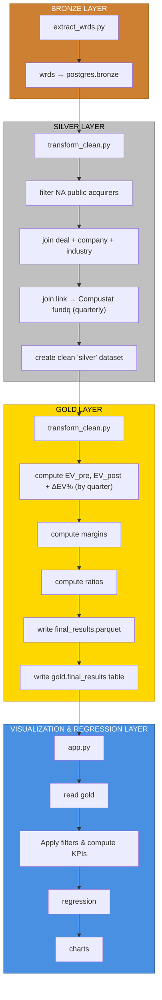

[](https://github.com/excecutors/wrds-ma-impact-pipeline/actions/workflows/main.yml)
# M&A Value Impact Pipeline (Local Deployment)

## Project Description

This project builds a complete data engineering pipeline that explores how mergers and acquisitions (M&A) affect a company's enterprise value (EV) and profitability. The data comes from WRDS (PitchBook, and Compustat), AlphaVantage and moves through a full local data workflow: ingestion, storage, transformation, orchestration, analysis, and testing.

Everything runs locally using **Docker and Apache Airflow**, with data stored in **PostgreSQL** and files organized in Bronze/Silver/Gold layers. This setup demonstrates modular design, reproducibility, and automation through GitHub Actions.

---

## Research Question

When a public company completes an acquisition, does its enterprise value improve from the prior quarter to the following quarter, and how does this vary by deal size, industry, or acquirer characteristics?

---

## Architecture Overview

```
project-root/
├── .devcontainer/              # Configuration for reproducible environment
│   ├── devcontainer.json       # VS Code config
│   ├── docker-compose.yml      # Defines App + Postgres services
│   └── Dockerfile              # Python environment definition
├── dags/                     ← Airflow DAG (extract → transform → analyze)
│   └── ma_pipeline_dag.py
├── src/
│   ├── extract_wrds.py       ← Pulls M&A + Compustat data from WRDS
│   ├── transform_clean.py    ← Cleans and joins deal + financial data
│   └── utils/                ← Helper functions and schema validation
│       └── db.py               # Database connection helper
├── postgres/
│   └── init.sql                # Database schema initialization (Bronze/Silver/Gold)
├── streamlit_app/              
│   └── app.py                  # Streamlit UI 
├── tests/                    ← Pytest unit and data quality tests
├── .env                        # Secrets (NOT synced to Git)
├── .gitignore                  # Git ignore rules
├── requirements.txt            # Python dependencies
└── README.md                   # Project Documentation
```

---

## Data Source   

To investigate the impact of M&A activity on enterprise value, our pipeline aggregates data from three primary sources covering transaction details, corporate financials, and industry classifications.   

#### 1. Transaction & Financial Data (WRDS)  

We utilize the Wharton Research Data Services (WRDS) platform to access our core datasets. This data is ingested programmatically using the `wrds` Python library, connecting directly to the WRDS PostgreSQL database. The extraction logic is encapsulated in `src/extract_wrds.py`.  

**PitchBook (via WRDS):**  

- Purpose: Provides the universe of M&A deals (`Merger/Acquisition`), including transaction dates, deal size, status, and buy-side relationships (linking deals to acquirers).  

- Tables Used: `ot_glb_deal`(https://wrds-www.wharton.upenn.edu/pages/get-data/pitchbook/other-row/deal/), `ot_glb_company`(https://wrds-www.wharton.upenn.edu/pages/get-data/pitchbook/other-row/company/), `ot_glb_companybuysiderelation`(https://wrds-www.wharton.upenn.edu/pages/get-data/pitchbook/other-row/company-buy-side-relation/).

**Compustat North America (via WRDS):**  

- Purpose: Provides quarterly fundamental financial data for the acquiring companies. We use this to retrieve point-in-time metrics such as Long-Term Debt, Cash, EBITDA, and Stock Prices to calculate Enterprise Value (EV) pre- and post-deal.  

- Table Used: `fundq`() (Fundamentals Quarterly)(https://wrds-www.wharton.upenn.edu/pages/get-data/compustat-capital-iq-standard-poors/compustat/north-america-daily/fundamentals-quarterly/).

#### 2. Industry Classification (AlphaVantage)

We source standardized industry and sector classifications from **AlphaVantage**(https://www.alphavantage.co/documentation/) to ensure accurate grouping of companies.

- Ingestion Strategy: Since the AlphaVantage API requires a unique API key and has rate limits, we have pre-fetched the necessary industry data to ensure smooth reproducibility for all users (including those without an API key).

- Storage: This data is stored locally as a static CSV file at `./src/company_industry.csv`. The transformation pipeline reads directly from this file to join industry information with the PitchBook company records.


## Prerequisites
You must have a WRDS account with access to PitchBook and Compustat databases.

- **Register for WRDS access:** https://library.fuqua.duke.edu/wrdsinfo.htm
- **Important:** After registration, you must set up **2-Factor Authentication** before you can access the API.


## Pipeline Components

### 1. Data Ingestion

Pulls M&A deal data from PitchBook and quarterly financial fundamentals from Compustat (fundq). These allow us to compute enterprise value in the quarter before and after each deal. Raw files stored in `data/bronze/`.

### 2. Data Storage

Data is stored in PostgreSQL or MinIO (S3-like) containers with schemas for `fact_transactions`, `fact_ev`, `fact_financials`, and `dim_company`.

### 3. Data Transformation and Analysis

Joins PitchBook companies to Compustat via gvkey (using WRDS “linking table”), aligns each deal date to pre- and post-quarter financial statements, and computes enterprise value for both quarters.

```
EV_pre  = EV in quarter ending immediately before deal date
EV_post = EV in quarter ending immediately after deal date

ΔEV% = (EV_post − EV_pre) / EV_pre

ΔMargin% = EBITDA_margin_post − EBITDA_margin_pre
```

Runs regression: `ΔEV% ~ deal_size_ratio`.

### 4. Airflow Orchestration

We use **Apache Airflow** to automate the full M&A Value Impact pipeline, from raw WRDS extraction to final Gold dataset creation.

Airflow runs **outside Docker** in a local Python virtual environment, while the actual data processing happens **inside the app container** using `docker exec`. This separation avoids dependency conflicts, improves reliability, and keeps pipeline execution isolated and reproducible.

### What Airflow Does

The DAG (`ma_value_impact_pipeline`) executes the classic **Bronze → Silver → Gold** workflow:

1. **load_bronze**: Pulls WRDS datasets (PitchBook + Compustat fundq) and loads them into Postgres Bronze tables.
2. **build_silver**: Cleans data, joins deal + financials, links gvkeys, and standardizes quarter alignment.
3. **build_gold**: Computes EV_pre, EV_post, ΔEV%, profitability changes, and writes both the Gold table and a parquet artifact.

Airflow provides:

* Automatic retries
* Clear dependency graphs
* Detailed logs for each stage
* Fully reproducible workflows
* Optional scheduling

### Running Airflow Locally

A full setup guide is provided here:
**`airflow/Airflow_env_README.md`**

This includes instructions for:

* Creating and activating the Airflow virtual environment
* Cleaning/resetting ports (8080/8793)
* Initializing the metadata database
* Running the scheduler and webserver
* Connecting Airflow to the Docker-based app
* Triggering and verifying the DAG

### 5. Containerization and CI/CD

Everything runs in Docker Compose with Airflow, Postgres, and MinIO containers. GitHub Actions handles linting, testing, and schema validation before merges.

### 6. Testing

Pytest covers schema integrity, missing/null checks, and logical validation (e.g., deal sizes not negative).

### 7. Visualization

Streamlit dashboard built from `data/gold/` to show results by industry.

---

## Team Roles

| Role | Responsibility |
|------|----------------|
| **Data Engineer** | Build and containerize the local environment using **Docker Compose** (Airflow, Postgres, MinIO). Implement data lake structure (Bronze → Silver → Gold) and manage credential security and local orchestration. |
| **Data Analyst** | Design and maintain **WRDS extraction scripts** (PitchBook, and Compustat), perform data cleaning and transformation with Polars, and document schema design for each stage of the pipeline. |
| **Fin/Quant Analyst** | Define **event windows** (pre/post M&A), calculate enterprise value (EV) and profitability metrics, run regression analyses, and create visual analytics to interpret the results for the final presentation. |
| **Data Architect & QA Engineer** | Define overall **pipeline architecture and metadata standards**, ensure modularity and observability in Airflow DAGs, and develop **automated validation tests** for schema integrity, data completeness, and reproducibility. |

---

## Data Engineering Principles

| Principle       | Implementation                                          |
| --------------- | ------------------------------------------------------- |
| Scalability     | Bronze → Silver → Gold layers allow incremental updates |
| Modularity      | Each script has a single, clear function                |
| Reusability     | Reusable helper functions and schema validators         |
| Observability   | Airflow logs and test reports track pipeline health     |
| Security        | WRDS credentials stored locally, not in repo            |
| Reproducibility | Docker ensures identical environments                   |

---

## Tech Stack

* **Python:** Polars, Pandas, Statsmodels
* **Storage:** PostgreSQL, MinIO (S3)
* **Orchestration:** Apache Airflow (Docker Compose)
* **CI/CD:** GitHub Actions, Pytest
* **Visualization:** Streamlit

---

## How to Run Locally
1. Clone the repository:  
```
git clone https://github.com/excecutors/wrds-ma-impact-pipeline.git
cd wrds-ma-impact-pipeline
```
2. Setup Configuration

**Prerequisites:** You must have a WRDS account with access to PitchBook and Compustat databases.

- **Register for WRDS access:** https://library.fuqua.duke.edu/wrdsinfo.htm
- **Important:** After registration, you must set up **2-Factor Authentication** before you can access the API.

Once you have your WRDS credentials, create a `.env` file in the project root:  
```
# .env
# Local Database Credentials (DO NOT CHANGE)
POSTGRES_USER=admin
POSTGRES_PASSWORD=strongpassword123
POSTGRES_DB=ma_pipeline_db

# Your WRDS Credentials (Required)
# Register at: https://library.fuqua.duke.edu/wrdsinfo.htm
# Setup 2FA before API access
WRDS_USERNAME=your_wrds_username
WRDS_PASSWORD=your_wrds_password
```

3. Start the Environment
Run the following command from the project root to build and start the containers:  
```bash
docker-compose -f .devcontainer/docker-compose.yml up -d --build
```
  
4. Run Data Ingestion  
Execute the ingestion script inside the running application container. The script will automatically handle WRDS authentication using your `.env` file.  
```bash
# 1. Enter the application container
docker exec -it ma_project_app bash

# 2. Step 1: Ingest Data (Bronze)
python src/extract_wrds.py

# 3. Step 2: Transform & Clean (Silver)
python src/transform_clean.py

# 4. Step 3: Compute Metrics (Gold)
python src/gold_layer.py
```
Then, you
5. Verify Data
Connect via DBeaver (`localhost:5432`, `user: admin`, `password: strongpassword123`, `dataset: ma_pipeline_db`) or check the output file:   `data/gold_data_.parquet`
    
6. Shutdown. 
When finished, stop the containers:  
```bash
docker-compose -f .devcontainer/docker-compose.yml down
``` 
  
Access Airflow at [http://localhost:8080](http://localhost:8080) and run the `ma_pipeline_dag` to execute the workflow.

---

## Deliverables

* Full GitHub repository and working pipeline
* README documentation and architecture diagram
* 5–10 minute walkthrough video
* Final results file (`/data/final_results.parquet`) with ΔEV% and regression output

---

## Summary

A reproducible, locally containerized data pipeline demonstrating end-to-end engineering — from data ingestion to regression analysis — to answer one question:

**Do M&A deals actually create value, and what drives the difference?**

---

## DAG Architecture


```mermaid
graph TD
    subgraph BRONZE["BRONZE LAYER"]
        A[extract_wrds.py]
        A1["wrds → postgres.bronze"]
        A --> A1
    end
    
    subgraph SILVER["SILVER LAYER"]
        B[transform_clean.py]
        B1["filter NA public acquirers"]
        B2["join deal + company + industry"]
        B3["join link → Compustat fundq (quarterly)"]
        B4["create clean 'silver' dataset"]
        B --> B1 --> B2 --> B3 --> B4
    end
    
    subgraph GOLD["GOLD LAYER"]
        C[transform_clean.py]
        C1["compute EV_pre, EV_post + ΔEV% (by quarter)"]
        C2["compute margins"]
        C3["compute ratios"]
        C4["write final_results.parquet"]
        C5["write gold.final_results table"]
        C --> C1 --> C2 --> C3 --> C4 --> C5
    end
    
    subgraph ANALYSIS["VISUALIZATION & REGRESSION LAYER"]
        D[app.py]
        D1["read gold"]
        D2[Apply filters & compute KPIs]
        D3["regression"]
        D4["charts"]
        D --> D1 --> D2 --> D3 --> D4
    end
    
    A1 --> B
    B4 --> C
    C5 --> D
    
    style BRONZE fill:#cd7f32,stroke:#8b5a00,color:#fff
    style SILVER fill:#c0c0c0,stroke:#808080,color:#000
    style GOLD fill:#ffd700,stroke:#daa520,color:#000
    style ANALYSIS fill:#4a90e2,stroke:#2e5c8a,color:#fff
```
