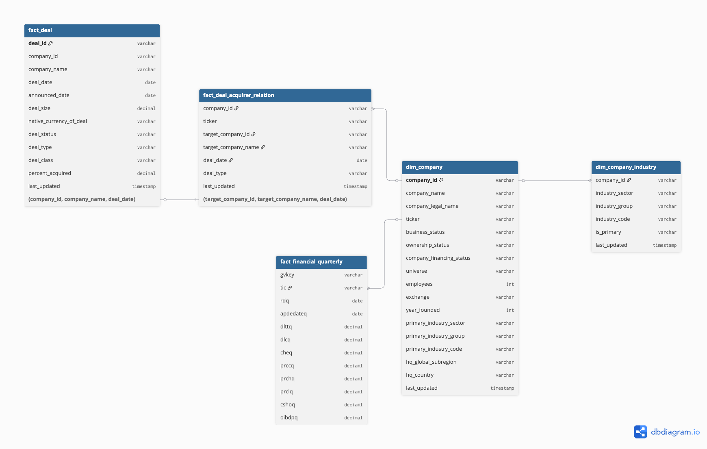

**Project Scope:**
We are targeting **Mergers & Acquisitions (M&A)** occurring between **2000-01-01 and 2024-11-30**. 
   
**Description of Bronze Layer:** Direct replica of WRDS tables. Applied basic filtering. No joins or renaming applied.
  
**Target Filters:**
* **Industry:** All Industry.
* **Acquirer:** North American , Publicly Traded companies.
* **Deal Specifics:** US Dollars (USD) , Acquisition ratio > 50%.

---

## 1. Table: `fact_deal` (M&A Deals)
* **Source:** WRDS PitchBook / Other Data Global / Deal  
* **WRDS Table Name:** `pitchbk_other_row.ot_glb_deal` 
* **Link:** https://wrds-www.wharton.upenn.edu/pages/get-data/pitchbook/other-row/deal/  
* **Update Frequency:** Weekly 
* **Global Filters:**
    * `announceddate` BETWEEN '2000-01-01' AND '2024-11-30' 
    * `dealstatus` = 'Completed' 
    * `dealtype` = 'Merge/Acquisition' 
    * `percentacquired` > 50 
    * `nativecurrencyofdeal` = 'US Dollars (USD)' 

| Field | Description |
| :--- | :--- |
| `dealid` | **Primary Key**  |
| `companyid` | Target Company ID |
| `companyname` | Target Company Name  |
| `dealdate` | Date the deal was completed |
| `announceddate` | Date the deal was announced |
| `dealsize` | Transaction value |
| `nativecurrencyofdeal` | Filter: Must be 'US Dollars (USD)' |
| `dealstatus` | Filter: Must be 'Completed'|
| `dealtype` | Filter: Must be 'Merge/Acquisition' |
| `dealclass` | e.g., Private Equity, Corporate, etc. |
| `percentacquired` | Filter: Must be > 50% (Controlling interest)  |

---

## 2. Table: `fact_deal_acquirer_relation`
* **Source:** WRDS PitchBook / Other Data Global / Company Buy Side Relation 
* **WRDS Table Name:** `pitchbk_other_row.ot_glb_companybuysiderelation` 
* **Link:** https://wrds-www.wharton.upenn.edu/pages/get-data/pitchbook/other-row/company-buy-side-relation/  
* **Join Logic to `fact_deal`:**
    * *Note: `dealid` is missing in this table, so we use a composite join:*
    * `Targetcompanyid` = `fact_deal.companyid`
    * AND `Targetcompanyname` = `fact_deal.companyname`
    * AND `Dealdate` = `fact_deal.Dealdate` 

| Field | Description |
| :--- | :--- |
| `Companyid` | ID of the Buy Side Company (The Acquirer) |
| `targetcompanyid` | ID of the Acquiree  |
| `targetcompanyname` | Name of the Acquiree  |
| `Dealdate` | Date of the deal  |
| `Dealtype` | Filter: `LIKE '%Merger/Acquisition%'`  |

---

## 3. Table: `dim_company` (Acquirer Info)
* **Source:** WRDS PitchBook / Other Data Global / Company 
* **WRDS Table Name:** `pitchbk_other_row.ot_glb_company` 
* **Link:** https://wrds-www.wharton.upenn.edu/pages/get-data/pitchbook/other-row/company/  
* **Filters:**
    * `hqglobalsubregion` = 'North America' 
    * `ownershipstatus` = 'Publicly Held' 

| Field | Description |
| :--- | :--- |
| `companyid` | PitchBook Company ID  |
| `companyname` | Company Name  |
| `businessstatus` | e.g. Bankruptcy: Admin/Reorg; Out of Business; Startup  |
| `ownershipstatus` | Filter: Must be 'Publicly Held'  |
| `companyfinancingstatus` | e.g. Angel-Backed; Corporation; Failed Transaction (Angel)  |
| `universe` | e.g. Debt Financed; M&A; M&A, Private Equity; M&A, Pre-venture, Venture Capital; Private Equity; Venture Capital  |
| `hqglobalsubregion` | Filter: Must be 'North America'  |
| `hqcountry` | Headquarters Country  |
| `ticker` | Ticker symbol  |
| `exchange` | Stock Exchange  |
| `primaryindustrysector` | Sector (e.g., Information Technology)  |
| `primaryindustrygroup` | Industry Group  |
| `primaryindustrycode` | Industry Code (e.g. Machinery (B2B); Energy Production)  |

---

## 4. Table: `dim_company_industry` (Industry Filter)
* **Source:** WRDS PitchBook / Other Data Global / Company Industry Relation 
* **WRDS Table Name:** `pitchbk_other_row.ot_glb_companyindustryrelation`  
* **Link:** https://wrds-www.wharton.upenn.edu/pages/get-data/pitchbook/other-row/company-industry-relation/  
* **Purpose:** Since a company can have multiple sectors, we use this table to filter Acquirers.
* **Filter Logic:** `industrysector` IN ('Financial Services', 'Information Technology'). Use `isprimary` to distinguish main industries.

| Field | Description |
| :--- | :--- |
| `companyid` | PitchBook Company ID  |
| `industrysector` | Sector Name (Tech/Finance)  |
| `industrygroup` | Group Name  |
| `industrycode` | Code  |
| `isprimary` | Flag for primary industry |

## 5. Table: `fact_financial_quarterly` (Fundamentals)
* **Source:** Compustat - Capital IQ / North America / Fundamentals Quarterly 
* **WRDS Table Name:** `comp_na_daily_all.fundq`  
* **Link:** https://wrds-www.wharton.upenn.edu/pages/get-data/compustat-capital-iq-standard-poors/compustat/north-america-daily/fundamentals-quarterly/  
* **Purpose:** To retrieve **Net Debt** and **EBITDA** at time points *t-5* and *t+30*.

| Field | Description |
| :--- | :--- |
| `gvkey` | Compustat Key  |
| `fyearq` | Fiscal Year |
| `fqtr` | Fiscal Quarter |
| `tic` | Ticker Symbol |
| `curncdq` | Native Currency Code |
| `dlttq` | Long-Term Debt - Total |
| `dlcq` | Debt in Current Liabilities |
| `cheq` | Cash and Short-Term Investments |
| `prccq` | Price Close - Quarter|
| `prchq` |   Price High - Quarter|
| `prclq` |   Price Low - Quarter|
| `cshoq` | Common Shares Outstanding|
| `oibdpq` | Operating Income Before Depreciation (EBITDA) |

